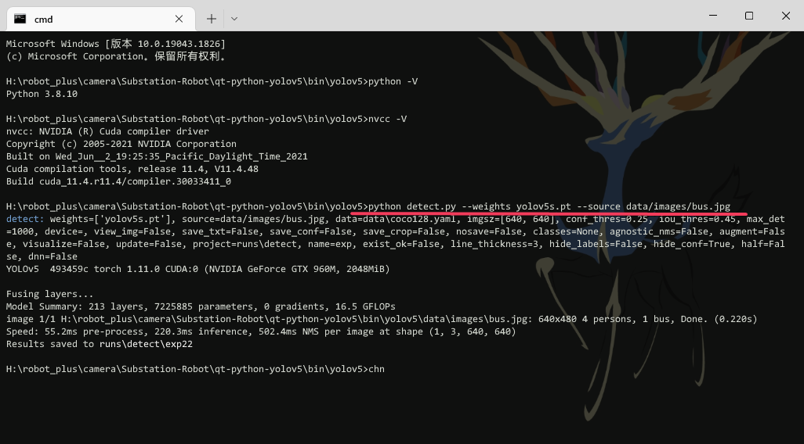
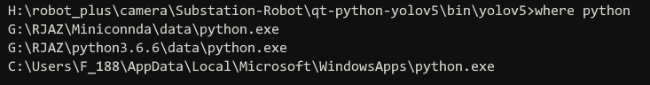
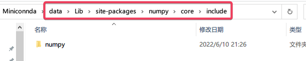
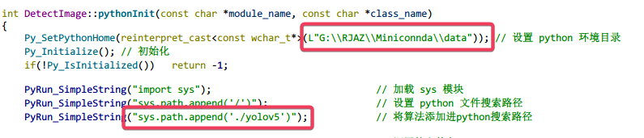
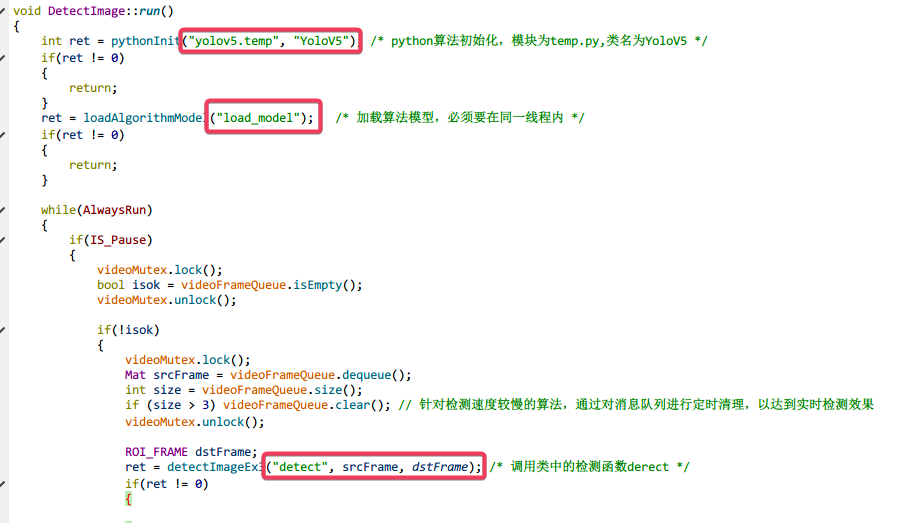
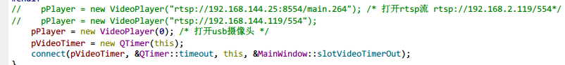

# QT_YoloV5_Demo

## 目录

1. [仓库更新 Top News](https://gitee.com/yunke120/substation-robot/tree/master/#top-news)
2. [所需环境 Environment](https://gitee.com/yunke120/substation-robot/tree/master/#%E6%89%80%E9%9C%80%E7%8E%AF%E5%A2%83)
3. [文件下载 Download](https://gitee.com/yunke120/substation-robot/tree/master/#%E6%96%87%E4%BB%B6%E4%B8%8B%E8%BD%BD)
4. [使用方式 How2use](https://gitee.com/yunke120/substation-robot/tree/master/#%E4%BD%BF%E7%94%A8%E6%96%B9%E5%BC%8F)
5. [参考资料 Reference](https://gitee.com/yunke120/substation-robot/tree/master/#%E5%8F%82%E8%80%83%E8%B5%84%E6%96%99)

## Top News


## 所需环境

1. 本机环境
   - QT 5.13.0
   - Python 3.8.10
   - VS2017 x64
   - cuda 11.4
   - opencv 4.5.2
2. 所需环境
   - QT >= Qt 5
   - Python >= 3.7 (根据算法所用版本，例如`yolov5`需要`Python>=3.7.0`，`PyTorch>=1.7`)

## 文件下载

```
git clone https://gitee.com/yunke120/qt-python-yolov5.git
```

## 使用方式

### 文件结构

```
.
├── bin/               /* release 目录 */
├── detectimage.cpp    /* 检测图片线程源文件 */ 
├── detectimage.h      /* 检测图片线程头文件 */
├── inc/               /* 外部头文件 */
├── libs/              /* 外部库文件 */
├── main.cpp           /* 启动入口 */
├── mainwindow.cpp     /* 主线程源文件 */
├── mainwindow.h       /* 主线程（GUI）头文件 */
├── mainwindow.ui      /* UI文件 */
├── paintlabel.cpp     /* 重写QLabel源文件 */
├── paintlabel.h       /* 重写QLabel头文件 */
├── README.md          /* 说明 */
├── Demo.pro          /* 工程文件 */
├── videoplayer.cpp    /* 接收视频线程源文件 */
└── videoplayer.h      /* 接收视频线程头文件 */
```

```
/bin文件结构：
├── opencv_videoio_ffmpeg452_64.dll /* 所需动态库 */
├── opencv_world452.dll
├── openh264-1.8.0-win64.dll
├── python38.dll
├── python3.dll
├── Demo.exe                       
└── yolov5/                         /* 你的算法 */
```

​		在运行此程序之前，需要完成以下几步：

​		1. 请确保您的`Python`算法能够单独运行，这是为了确保能够成功调用`Python`算法。

​		以`YoloV5`为例，打开`yolov5`文件夹，运行

```
python detect.py --weights yolov5s.pt --source data/images/bus.jpg
```

​		运行成功即可。

​		

​		2. 修改目录`bin`、`libs`、`inc`下的`python`相关文件。这些文件需要与你在步骤1中使用的`Python`环境对应，查看当前`Python`安装目录，执行命令`where python`。



​		我所使用的`Python 3.8.10`版本在第一个，打开这个路径`G:\RJAZ\Miniconnda\data`，在里面找到`python3.dll`和`python38.dll`拷贝到`bin`目录下； 打开`.../data/libs`目录，拷贝`python3.lib`和`python38.lib`到`libs`目录下；拷贝`.../data/include`整个文件夹到`inc`目录下，并改名为`python`；拷贝`.../data/Lib/site-packages/numpy/core/include`下的`numpy`文件夹到`inc`目录下；



​		至此，`python`所需文件都已经替换完毕。下面是代码的修改。

​		3. 修改程序中相关代码

  1. `.pro`文件，宏`USING_DETECT`开启检测，注销后不会启用检测

     ```
     DEFINES += USING_DETECT
     INCLUDEPATH += $$PWD/inc
     INCLUDEPATH += $$PWD/inc/python
     LIBS += -L$$PWD/libs             \
                   -lopencv_world452 \
                   -lpython3         \
                   -lpython38
     ```

  2.  `detectimage.cpp`文件

     `pythonInit`函数：修改`python`搜索路径和算法路径

     

     `run()`函数：修改要调用算法的模块名、类名、函数名等（需要修改以下`yolov5`中的`detect.py`函数，将其封装为一个类调用，请往下看）

     

     `mainwindow.cpp`文件

     `playerInit`函数：选择摄像头，支持`usb`摄像头和`rtsp`等拉流方式

     

   4. 将`detect.py`封装为类进行调用

      ​		封装为类的好处是，只需在`python`算法初始化时加载一次模型，后续检测不需要重复加载，节省时间。`Qt`需要给`python`脚本传递图片，故检测函数`detect`函数需要有一个入口参数`frame`(一帧图像)，经过模型检测后，将自己需要的结果`return`即可。

      ​		在程序中`yolov5`的封装示例为`temp.py`，其中类名为`YoloV5`，变量初始化在`__init__`中，加载模型函数为`load_model`，图像检测函数为`detect`，其输入为一个`Mat`类型的图像，输出为检测之后的图像`Mat`、图像的类列表和对应的置信度列表。

      